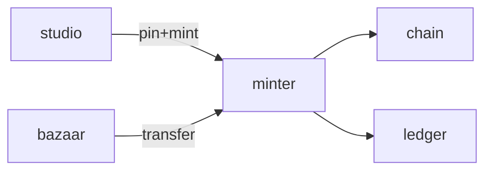

# Minter

**Minting Engine** — Dedicated backend for blockchain mint, pin, and transfer — extracted from the flagship verifier.

Part of [ComputerPets](https://github.com/RicheyWorks/computerpets). Map: [computerpets-ecosystem](https://github.com/RicheyWorks/computerpets-ecosystem).

| | |
| --- | --- |
| Status | Design scaffold — contract frozen, implementation next |
| License | MIT |
| First pet | Still [Rui on the desktop](https://github.com/RicheyWorks/computerpets/blob/main/docs/START-HERE.md). This organ is optional. |

## The job

Flagship already checks Ethereum ownership. Minter is the write path: pin metadata, mint, transfer, burn. One service so Steam and the overlay never talk to a chain RPC themselves.

The flagship overlay already puts a living sticker on the real desktop (Rui first, 210 kinds). Minter does not replace that. It is one organ.

## Who uses it

Bazaar, Studio, Hatchery, Ledger. The only chain write path.

## What it is not

Not a wallet. Overlay never talks to an RPC. Steamgate never talks to an RPC.

## Architecture



## Stack

Java 21 · Spring Boot 3.3 · web3j 4.12 · IPFS / Pinata · Flyway · PostgreSQL · Resilience4j

GroupId / namespace: `com.enterprisepet.minter`  
Default listen: `8081`

## Contract

### Data

`Pin(cid, sha256) · MintJob(id, status, tokenId, txHash) · Transfer(from, to, tokenId)`

### Surface

- POST /v1/pin — metadata JSON + asset → CID
- POST /v1/mint — {owner, speciesId, cid} → tokenId + txHash
- POST /v1/transfer — escrow-safe transfer
- POST /v1/burn — owner-signed burn
- GET /v1/tx/{hash} — confirmation depth

### Failure doctrine

RPC flake → Resilience4j retry + circuit open. Underpriced gas → park job. Reorg below N confirms → do not credit overlay unlock.

## First slice

Build this and stop. Do not boil the ocean.

**Pin metadata + mint on a testnet + confirmation watcher. Flyway table `mint_job`.**

You know it works when: RPC flake: retry then circuit open. Under N confirms: overlay does not unlock. Reorg: job parked.

## Environment

`RPC_URL`, `MINTER_KEY_VAULT`, `IPFS_PIN`, `DATABASE_URL`

Never commit secrets. Never put Steam or chain keys in the overlay.

## Neighbors

- computerpets Spring verifier
- computerpets-bazaar
- computerpets-atelier
- computerpets-ledger
- computerpets-studio

## Layout

```
computerpets-minter/
  README.md           this file
  LICENSE             MIT
  docs/CONTRACT.md    the same contract, frozen for implementers
  src/                implementation lands here
```

## Run (Windows)

PowerShell, from this folder, after the flagship helpers (Git, Node LTS 22+, JDK 21 as needed):

```powershell
mvn -q -DskipTests package; java -jar target/minter-1.0.0-SNAPSHOT.jar
```

You do not need this service to meet Rui. The [flagship start-here](https://github.com/RicheyWorks/computerpets/blob/main/docs/START-HERE.md) is still the first pet.

## Links

- Flagship: [RicheyWorks/computerpets](https://github.com/RicheyWorks/computerpets)
- This repo: [RicheyWorks/computerpets-minter](https://github.com/RicheyWorks/computerpets-minter)
- Map: [RicheyWorks/computerpets-ecosystem](https://github.com/RicheyWorks/computerpets-ecosystem)
- Contract file: [docs/CONTRACT.md](docs/CONTRACT.md)

## License

MIT. See [LICENSE](LICENSE).

---

*Two hundred ten living kinds. Keep them so a line does not go quiet.*
