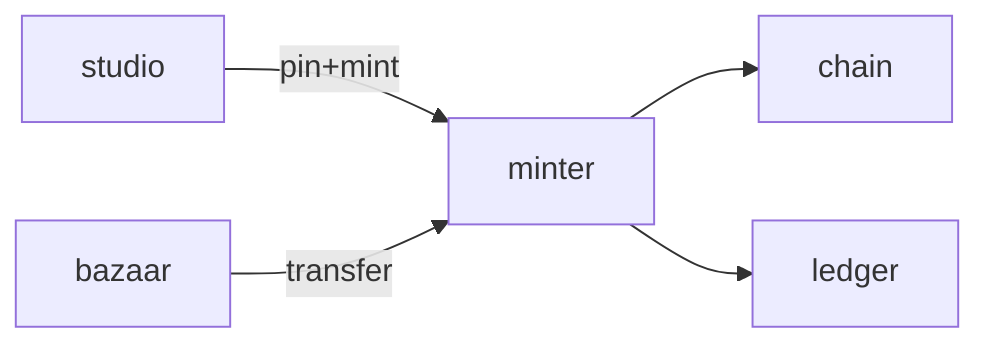

# Minter

**Minting Engine** — A planned backend for pinning pet metadata and coordinating blockchain mint and transfer jobs.

Part of [ComputerPets](https://github.com/RicheyWorks/computerpets). Map: [computerpets-ecosystem](https://github.com/RicheyWorks/computerpets-ecosystem).

[Status](#status) · [Contract](docs/CONTRACT.md) · [Contributor start](#contributor-start) · [Ecosystem](https://github.com/RicheyWorks/computerpets-ecosystem)

| Project | At a glance |
| --- | --- |
| Status | Design scaffold; not runnable yet |
| License | MIT |
| First pet | [Flagship start guide](https://github.com/RicheyWorks/computerpets/blob/main/docs/START-HERE.md) |

## Status

This repository contains a [contract](docs/CONTRACT.md) and a [source placeholder](src/main/java/com/enterprisepet/minter/package-info.java). It has no runnable application, build manifest, automated tests, or CI workflow.

The experience, interfaces, integrations, and safeguards below are **implementation plans**, not supported features. The first implementation slice defines the initial contribution target.

## Planned role

Minter is intended to provide a dedicated write path: pin metadata, mint, transfer, burn. One service so Steam and the overlay never talk to a chain RPC themselves.

For the desktop pet, start with the [flagship guide](https://github.com/RicheyWorks/computerpets/blob/main/docs/START-HERE.md).

## Intended audience

Bazaar, Studio, Hatchery, Ledger. The only chain write path.

## Out of scope

Not a wallet. Overlay never talks to an RPC. Steamgate never talks to an RPC.

## Proposed integration



## Planned stack

Java 21 · Spring Boot 3.3 · web3j 4.12 · IPFS / Pinata · Flyway · PostgreSQL · Resilience4j

GroupId / namespace: `com.enterprisepet.minter`  
Proposed listen surface: `8081`

## Proposed contract

### Data

`Pin(cid, sha256) · MintJob(id, status, tokenId, txHash) · Transfer(from, to, tokenId)`

### Surface

- POST /v1/pin — metadata JSON + asset → CID
- POST /v1/mint — {owner, speciesId, cid} → tokenId + txHash
- POST /v1/transfer — escrow-safe transfer
- POST /v1/burn — owner-signed burn
- GET /v1/tx/{hash} — confirmation depth

### Planned safeguards

RPC flake → Resilience4j retry + circuit open. Underpriced gas → park job. Reorg below N confirms → do not credit overlay unlock.

## First implementation slice

Initial implementation target:

**Pin metadata + mint on a testnet + confirmation watcher. Flyway table `mint_job`.**

Acceptance targets: RPC flake: retry then circuit open. Under N confirms: overlay does not unlock. Reorg: job parked.

## Planned environment

`RPC_URL`, `MINTER_KEY_VAULT`, `IPFS_PIN`, `DATABASE_URL`

Never commit secrets. Never put Steam or chain keys in the overlay.

## Related projects

- [computerpets](https://github.com/RicheyWorks/computerpets) Spring verifier
- [computerpets-bazaar](https://github.com/RicheyWorks/computerpets-bazaar)
- [computerpets-atelier](https://github.com/RicheyWorks/computerpets-atelier)
- [computerpets-ledger](https://github.com/RicheyWorks/computerpets-ledger)
- [computerpets-studio](https://github.com/RicheyWorks/computerpets-studio)

## Layout

```
computerpets-minter/
  README.md           this file
  LICENSE             MIT
  docs/CONTRACT.md    the same contract, frozen for implementers
  src/                implementation lands here
```

## Contributor start

With Git and PowerShell, clone the scaffold and read its contract and source marker:

```powershell
git clone https://github.com/RicheyWorks/computerpets-minter.git
Set-Location computerpets-minter
Get-Content .\docs\CONTRACT.md
Get-Content .\src\main\java\com\enterprisepet\minter\package-info.java
```

Start with the [first implementation slice](#first-implementation-slice). Add the minimum project setup and tests needed for that slice, then document verified run commands. The proposed stack above is a design choice; there is no install or launch command for this checkout yet.

## Links

- Flagship: [RicheyWorks/computerpets](https://github.com/RicheyWorks/computerpets)
- This repo: [RicheyWorks/computerpets-minter](https://github.com/RicheyWorks/computerpets-minter)
- Map: [RicheyWorks/computerpets-ecosystem](https://github.com/RicheyWorks/computerpets-ecosystem)
- Contract file: [docs/CONTRACT.md](docs/CONTRACT.md)

## License

MIT. See [LICENSE](LICENSE).

---

*Two hundred ten living kinds. Keep them so a line does not go quiet.*
